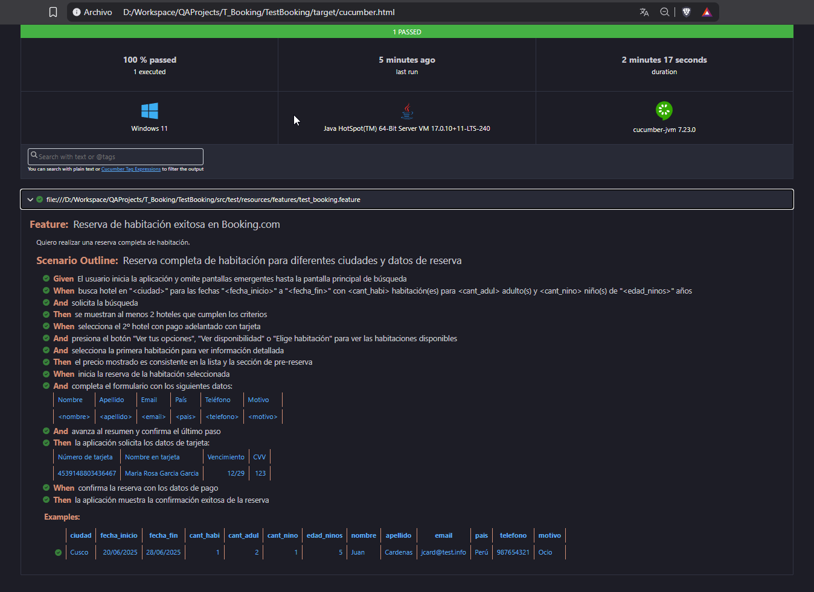

# **AUTOMATION TEST - BOOKING MOBILE APP**

# OBJETIVO

1. Desarrollar el plan de pruebas para la automatización de pruebas de la aplicación de reserva hotelera:
   * Aplicación móvil Android de Booking.com ([Archivo APK](https://apkarchive.org/download/split/booking-com-hotels-and-more/com.booking/22581209/2001769)).
2. Desarrollar el código para las pruebas automatizadas del flujo de reserva y especificar la cobertura de pruebas según:
   * Automatizar las funcionalidades del flujo completo de una reserva.
   * Incluir escenarios de prueba Happy Paths y Unhappy Paths.
   * Incluir todas las aserciones posibles.
3. Especificar las herramientas y técnicas utilizadas.

# SOLUCIÓN

> ***Nota**: Se sugiere visualizar los archivos **.md** directamente en el repositorio Github o usar un editor local si se descarga el proyecto.*

###### 1. Plan de Pruebas

| Documento  | Ruta/Archivo |
| --- | --------- |
| Plan de pruebas | [TEST_PLAN.md](./TEST_PLAN.md) |
| Casos de pruebas | [TestBooking\src\test\resources\features\test_booking.feature](./TestBooking/src/test/resources/features/test_booking.feature) |

###### 2. Código y cobertura

- Proyecto Java/Cucumber/Appium para automatización: `TestBooking\`
- La cobertura de las pruebas es:
  - Realizar la búsqueda de hoteles.
  - Escoger el hotel y la habitación.
  - Reservar la habitación.
  - Escenarios de pruebas establecidos en el **[Plan de Pruebas](./TEST_PLAN.md) sección 7.**

###### 3. Herramientas y técnicas

- Para las herramientas utilizadas ver el **[Plan de Pruebas](./TEST_PLAN.md) sección 4**.
- Para las técnicas utilizadas ver el **[Plan de Pruebas](./TEST_PLAN.md) sección 6**.

**DEMO**

**REPORTE** (`HTML File --> <ProjectPath>/target`)

END
